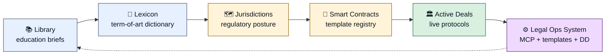
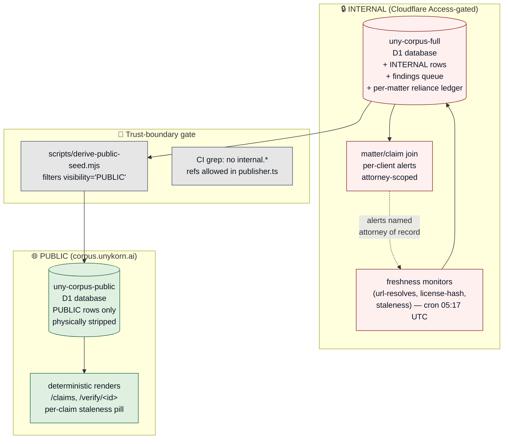
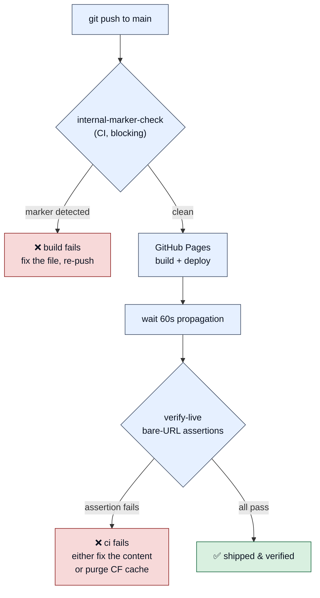

<div align="center">

# Unykorn Legal

**Global open legal infrastructure for tokenized securities and real-world assets.**

[](./LICENSE)
[](./LICENSE-APACHE-2.0)
[](https://legal.unykorn.ai)
[](./NOTICE-NOT-LEGAL-ADVICE.md)
[](https://legal.unykorn.ai)
[](./.github/workflows/verify-live.yml)

**Six connected sections · Primary-source citations · Every deployment CI-verified against the served response**

</div>

---

## Table of Contents

1. [What this is](#what-this-is)
2. [Live site](#live-site)
3. [How the sections connect](#how-the-sections-connect) *(architecture map)*
4. [The six sections](#the-six-sections)
5. [Discipline coverage matrix](#discipline-coverage-matrix)
6. [Deploy pipeline](#deploy-pipeline) *(three-gate discipline)*
7. [Repository layout](#repository-layout)
8. [About Unykorn LLC](#about-unykorn-llc)
9. [License &amp; rules of use](#license--rules-of-use)
10. [Not legal advice](#not-legal-advice)
11. [Contributing](#contributing)

---

## What this is

Unykorn Legal is the public reference layer for tokenized securities and
real-world-asset (RWA) legal operations. It is authored as **educational
reference material**, not as an offering document or a substitute for
licensed counsel. Every claim is cited to the operative statute,
regulation, or industry-standard document.

The site is generated from this repository via GitHub Pages, fronted by
Cloudflare DNS on `legal.unykorn.ai`.

### Live site

**<https://legal.unykorn.ai>** — full public reference.

---

## How the sections connect

The site is not a flat menu of pages — it is a workflow. A sponsor or
operator reads the **Library** to understand the asset class, then uses
the **Lexicon** to translate terms, checks the **Jurisdictions** map for
regulatory posture, adopts a **Smart Contract** template, watches
**Active Deals** for peer benchmarks, and drives the whole flow through
the open-source **Legal Ops System**.



**The corpus layer.** Above the six public sections sits an internal
**corpus** (see [`dev/platforms/uny-corpus/`](https://github.com/FTHTrading/legal))
that is the publisher-of-record for every claim on the site — a database
where every PUBLIC row must carry a primary-source URL and a
`verified_on` date (enforced by a DB trigger, not a review process).



---

## The six sections

| # | Section | Path | What's inside |
|---|---------|------|--------------|
| **01** | **Library** *(education)* | [`/library/`](https://legal.unykorn.ai/library/) | RWA fundamentals, GENIUS Act (Pub. L. 119-27), real-estate securities, private credit, contract-law primer |
| **02** | **Lexicon** *(dictionary)* | [`/lexicon/`](https://legal.unykorn.ai/lexicon/) | Working dictionary of securities, tokenization, custody, structuring, and compliance terminology |
| **03** | **Jurisdictions** *(map)* | [`/jurisdictions/`](https://legal.unykorn.ai/jurisdictions/) | US federal + state, UK FCA, EU MiCA, Singapore MAS, DIFC, ADGM, HK SFC, Swiss FINMA |
| **04** | **Smart Contracts** *(templates)* | [`/smart-contracts/`](https://legal.unykorn.ai/smart-contracts/) | Unykorn's own contract library ([`smartcontract.unykorn.ai`](https://smartcontract.unykorn.ai), 24 contracts / 17 families) + external standards |
| **05** | **Active Deals** *(registry)* | [`/deals/`](https://legal.unykorn.ai/deals/) | Live RWA protocols: Ondo, Centrifuge, Maple, Aave Horizon, Superstate, BlackRock BUIDL, Franklin BENJI |
| **06** | **Legal Ops System** *(engine)* | [`/system/`](https://legal.unykorn.ai/system/) | Open-source MCP server: 25 tools, 17 templates, 9 DD providers, SPV-in-a-Box workflow |

---

## Discipline coverage matrix

Each of the following disciplines is threaded across all six sections
(the Library brief, the Lexicon terms, the jurisdictional posture, the
smart-contract templates, the live-deals registry, and the operator
tooling). Color legend: 🟦 asset structure · 🟨 monetary primitives · 🟩 physical/energy · 🟪 people/rights.

| 🟦 Structural | 🟨 Monetary | 🟩 Physical | 🟪 People/Rights |
|---|---|---|---|
| **Real Estate** — multifamily, hospitality, industrial, CMBS tranching, construction-draw escrow, tokenized REITs | **Stablecoins** — GENIUS Act framework, 1:1 reserve regime, OCC + state pathways, foreign-issuer rules | **Precious Metals** — vault-backed gold/silver, LBMA good-delivery, warehouse receipts | **Sports/Media/IP** — athlete NIL vehicles, music-catalog royalty streams, film-slate financing |
| **Private Credit** — direct lending, mezzanine, distressed, revenue-based, trade finance, invoice factoring | **Digital Securities** — ERC-3643 (T-REX), ERC-1400 partitioned tokens, ONCHAINID identity, compliance modules | **Energy &amp; Infrastructure** — Solar SPV, PPA-backed offtake, SREC monetization, BESS financing | **Federal &amp; Grant Capital** — SAM.gov, UEI/CAGE verification, ITC/PTC monetization, grant-flow routing |
| **Private Equity &amp; VC** — buyouts, growth equity, NVCA model docs, SAFEs, token warrants, LPA framework | **Tokenized Treasuries** — Ondo OUSG/USDY, Superstate USTB, Franklin BENJI, BlackRock BUIDL | **Commodities** — oil &amp; gas royalty tokenization, agricultural forward contracts | |

---

## Deploy pipeline

Three gates enforce that what ships is what a reader sees.



See **[DEPLOY.md](./DEPLOY.md)** for the full operator runbook,
`scripts/verify-live.sh` for the live-check script, and
`scripts/live-assertions.json` for the current assertion catalog.

**Why three gates?** In the 2026-08-07/08 incidents, two failure modes
surfaced: (a) internal-marked documents were accidentally published, and
(b) a fix that was in `git HEAD` was still serving pre-fix content at
the canonical URL. Gate 1 blocks (a); Gate 2 + 3 close (b).

---

## Repository layout

```
legal-repo/
├── index.html                  ← home / hub
├── library/                    ← 01 education briefs
├── lexicon/                    ← 02 term dictionary
├── jurisdictions/              ← 03 regulatory posture per country
├── smart-contracts/            ← 04 template registry
├── deals/                      ← 05 active protocols registry
├── system/                     ← 06 legal-ops MCP documentation
├── notice/                     ← attorney-advertising + UPL notice
├── _ds/                        ← design system CSS (tokens/layout/components/shell)
├── _assets/                    ← sample inputs, downloadable artifacts
├── scripts/
│   ├── verify-live.sh          ← post-deploy bare-URL assertions
│   └── live-assertions.json    ← 7 URLs / 26 present + 11 absent tokens
├── .github/workflows/
│   ├── internal-marker-check.yml    ← pre-merge marker gate
│   └── verify-live.yml         ← post-deploy live-content gate
├── CNAME                       ← legal.unykorn.ai
├── .nojekyll                   ← serves _ds/ correctly
├── DEPLOY.md                   ← three-gate operator runbook
├── LICENSE                     ← MIT (default for site content)
├── LICENSE-APACHE-2.0          ← alternative permissive license
├── NOTICE-NOT-LEGAL-ADVICE.md  ← UPL disclosures
└── README.md                   ← this file
```

---

## About Unykorn LLC

**Unykorn LLC** is the sole active operating entity behind this project.

| Field | Value |
|-------|-------|
| Legal name | Unykorn LLC |
| Jurisdiction | Wyoming (US) |
| Filed | 2026-07-01 |
| EIN | 42-3536633 |
| D-U-N-S | 145059107 |
| WY Filing ID | 2026-002019968 |
| GLEIF LEI | *(not registered)* |
| ISO MIC | *(not registered)* |

**Prior identifier note.** Earlier versions of this repo listed a GLEIF
LEI (`2549008J7LUHSQ73SI26`) and MIC (`UBEC`) alongside Unykorn LLC.
Those identifiers were removed on 2026-08-08 after a GLEIF public API
lookup confirmed they are registered to an unrelated Georgia trust, not
to Unykorn LLC. If regulatory reporting later requires an LEI for
Unykorn LLC, one will be applied for through a Local Operating Unit;
until that application is confirmed, Unykorn LLC does not claim an LEI.

**Historical entity.** UNYKORN 7777 INC. was deprecated on 2026-08-07.
All operations, footers, and materials are Unykorn LLC.

---

## License &amp; rules of use

This repository is dual-licensed at the recipient's option:

<table>
<tr>
<td width="50%" valign="top">

### 🅼 MIT License *(default)*

**File:** [`LICENSE`](./LICENSE)

Recipients may use, copy, modify, distribute, and sublicense the
Documentation and Software for any purpose, including commercial use,
provided the copyright notice and permission notice are preserved in
substantial portions.

*Best for:* forking a single template, embedding a snippet, or
building on top with maximum freedom.

</td>
<td width="50%" valign="top">

### 🅐 Apache License 2.0 *(alternative)*

**File:** [`LICENSE-APACHE-2.0`](./LICENSE-APACHE-2.0)

Recipients get the same permissions as MIT plus an **explicit patent
license grant** and a **NOTICE-file requirement**. Contributions become
licensed under Apache-2.0 automatically.

*Best for:* enterprise adopters that require an explicit patent grant,
or forks that will accept external contributions with clearer patent
provenance.

</td>
</tr>
</table>

### Rules of use *(both licenses)*

1. **Not legal advice.** Nothing in this repository or on
   `legal.unykorn.ai` constitutes legal advice, tax advice, ERISA
   advice, or investment advice. Every generated artifact requires
   review and sign-off by a licensed attorney qualified in the relevant
   jurisdiction. See [NOTICE-NOT-LEGAL-ADVICE.md](./NOTICE-NOT-LEGAL-ADVICE.md).

2. **Attorney of record.** The attorney signing the Review Manifest is
   the person rendering the legal opinion. Unykorn LLC provides
   scrivener and screening tools that operate under attorney direction;
   Unykorn LLC does not practice law.

3. **No endorsement.** External links (protocols, custodians, regulators,
   third-party data sources) are references. Unykorn LLC does not
   endorse, control, or take responsibility for their accuracy,
   availability, or continued operation.

4. **Freshness discipline.** Every published claim on `legal.unykorn.ai`
   carries a primary-source URL and a `verified_on` date. If a claim
   appears without both, please [open an issue](https://github.com/FTHTrading/legal/issues)
   — it is a bug.

5. **Per-file template license overrides.** Individual smart-contract
   templates and legal document templates in `_assets/` may carry their
   own per-file license (`public-domain`, `sec-filing-public`,
   `free-industry-standard`, `apache-2.0`, `cc0`, `cc-by`, or
   `internal`). When a per-file license exists, it governs that file.

6. **No warranty.** As stated in both LICENSE files: THE SOFTWARE IS
   PROVIDED "AS IS", WITHOUT WARRANTY OF ANY KIND.

7. **Trademarks.** "Unykorn" and "Unykorn Legal" are trademarks of
   Unykorn LLC. The licenses grant no trademark rights.

---

## Not legal advice

Nothing in this repository constitutes legal advice, tax advice, ERISA
advice, or investment advice. Every generated artifact requires review
and sign-off by a licensed attorney qualified in the relevant
jurisdiction. The attorney signing the Review Manifest is the person
rendering the legal opinion.

See [NOTICE-NOT-LEGAL-ADVICE.md](./NOTICE-NOT-LEGAL-ADVICE.md) and the
live [Notice — Not Legal Advice](https://legal.unykorn.ai/notice/) page.

---

## Contributing

1. Open an issue at [github.com/FTHTrading/legal/issues](https://github.com/FTHTrading/legal/issues)
   describing the correction, citation, or new content.
2. If proposing a change, include a **primary-source URL** and the
   **verified-on date** you checked.
3. Send a pull request against `main`.
4. Both CI gates (`internal-marker-check` and `verify-live`) must pass.
5. By contributing, you agree your contribution is licensed under
   **both** MIT and Apache-2.0 at the recipient's option.

---

<div align="center">

**Operated by Unykorn LLC** (Wyoming) &middot; EIN 42-3536633 &middot; D-U-N-S 145059107

<sub>© 2026 Unykorn LLC. Open reference material. Not legal advice.</sub>

</div>
